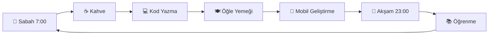

# 👋 Merhaba, Ben Emir Tiryaki!

## 🚀 Full Stack Developer & Tech Entrepreneur

> "Kod yazmak bir sanattır, her satır bir fırça darbesidir." - Emir Tiryaki

### 🎯 Hakkımda

Merhaba! Ben **Emir Tiryaki**, tutkulu bir Full Stack Developer ve teknoloji girişimcisiyim. 18+ proje geliştirdim ve 4 farklı marka oluşturdum. Modern web teknolojileri konusunda uzmanım ve kullanıcı deneyimini ön planda tutan çözümler üretiyorum.

### 🏢 Oluşturduğum Markalar

- **Tiryaki Yazılım** - Yazılım geliştirme şirketi
- **Odak Software** - Endüstriyel yazılım çözümleri  
- **Figrinova** - Eğitim teknolojileri
- **Kodlasa** - Kodlama eğitimi platformu

### 🛠️ Teknoloji Stack'im

```typescript
const emirTiryaki = {
  name: "Emir Tiryaki",
  role: "Full Stack Developer",
  location: "Türkiye",
  
  frontend: ["React", "TypeScript", "Next.js", "Tailwind CSS", "Shadcn/ui"],
  backend: ["Node.js", "Python", "PHP", "Express.js", "Django", "Laravel"],
  mobile: ["React Native", "Flutter"],
  database: ["MongoDB", "PostgreSQL", "MySQL"],
  devops: ["Docker", "AWS", "Vercel", "Git", "CI/CD"],
  
  interests: ["Web Development", "Mobile Apps", "E-commerce", "AI/ML"],
  currentlyLearning: ["Advanced React Patterns", "System Design"],
  
  funFact: "Günde 8+ saat kod yazıyorum ve hala öğrenmeye devam ediyorum! 🚀"
}
```

### 📊 GitHub İstatistiklerim


### 🎨 Öne Çıkan Projelerim

<table>
  <tr>
    <td width="50%">
      <h3 align="center">🌐 Web Uygulamaları</h3>
      <p align="center">
        <a href="https://egeateknik.com" target="_blank">
          
        </a>
        <br/>
        <a href="https://cebinde.kodlasa.com" target="_blank">
          
        </a>
        <br/>
        <a href="https://fishero.kodlasa.com" target="_blank">
          
        </a>
      </p>
    </td>
    <td width="50%">
      <h3 align="center">📱 Mobil Uygulamalar</h3>
      <p align="center">
        
        <br/>
        
        <br/>
        
      </p>
    </td>
  </tr>
</table>

### 🏆 Yeteneklerim

#### Frontend Development


#### Backend Development


#### Mobile Development


#### Database & DevOps


### 📈 Proje İstatistiklerim

- **🌐 Web Uygulamaları**: 12 proje
- **📱 Mobil Uygulamalar**: 4 proje  
- **🛒 E-ticaret**: 2 proje
- **🏢 Oluşturulan Markalar**: 4 şirket
- **👥 Takım Liderliği**: 5+ proje
- **⏱️ Toplam Deneyim**: 3+ yıl

### 🎯 Şu Anda Üzerinde Çalıştığım

- 🔥 **AI/ML Projeleri** - Yapay zeka entegrasyonu
- 🚀 **Microservices** - Ölçeklenebilir mimari
- 📱 **Cross-platform Apps** - React Native & Flutter
- 🌐 **Web3 Integration** - Blockchain teknolojileri

### 📫 İletişim

[](https://www.linkedin.com/in/emir-tiryaki/)
[](https://github.com/emirirr)
[](https://instagram.com/emir.tsx)
[](https://youtube.com/@emirtiryaki)
[](https://emirtiryaki.com)

**📧 E-posta**: info@emirtiryaki.com  
**📱 WhatsApp**: [+90 543 447 6245](https://wa.me/905434476245)  
**💬 Telegram**: [@emirirr](https://t.me/emirirr)

### 🎉 Fun Facts

- 🎮 **Oyun**: Valorant oynamayı seviyorum
- ☕ **İçecek**: Kahve olmadan kod yazamam
- 🎵 **Müzik**: Lo-fi beats ile kod yazıyorum
- 📚 **Kitap**: Teknoloji ve felsefe kitapları okuyorum
- 🌍 **Hedef**: Dünyayı değiştiren uygulamalar geliştirmek

### 📊 Günlük Rutinim



---

### 🚀 Son Söz

> "Teknoloji sadece araç değil, hayatı değiştiren bir güçtür. Ben bu gücü kullanarak insanların hayatını kolaylaştıran çözümler üretiyorum."

**⭐ Bu profili beğendiyseniz yıldız vermeyi unutmayın!**

---

*Son güncelleme: 2024* | *Made with ❤️ by Emir Tiryaki* 
