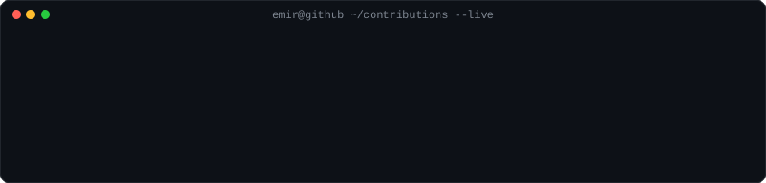
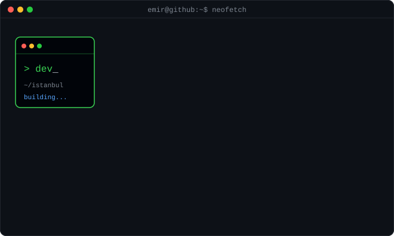

<!--
  Bu profil README'si bir "terminal" olarak tasarlanmıştır.
  Hareketin tamamı kendi kendine yeten SVG dosyalarının içindedir
  (GitHub, README'lerden <script> ve inline CSS'i temizler ama
   ile gömülü SVG'lerin SMIL / CSS animasyonlarını oynatır).

  Parçalar:
    contrib-heatmap.svg  -> canlı katkı takvimi  (GitHub Actions ile her gün yenilenir)
    info-card.svg        -> neofetch tarzı kart   (statik; scripts/make_info_card.py)

  Yeniden üretmek için:
    pip install -r scripts/requirements.txt
    python scripts/fetch_contributions.py && python scripts/render_heatmap_svg.py
    python scripts/make_info_card.py
-->

<h3><code>emir@github ~ $ ./contributions.sh</code></h3>

  

<h3><code>emir@github ~ $ whoami</code></h3>

  

<h3><code>emir@github ~ $ ls ./links</code></h3>

  

<code>emir@github ~ $</code> <em>katkı grafiği her gün ~06:17 UTC otomatik yenilenir · portre yok, neofetch + canlı heatmap</em>

